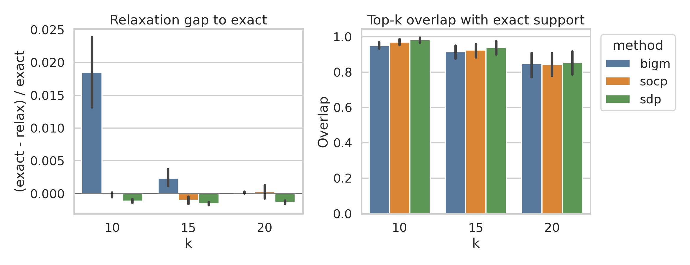
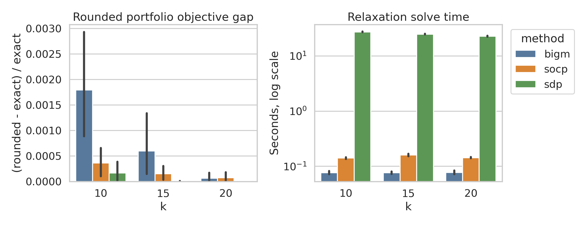
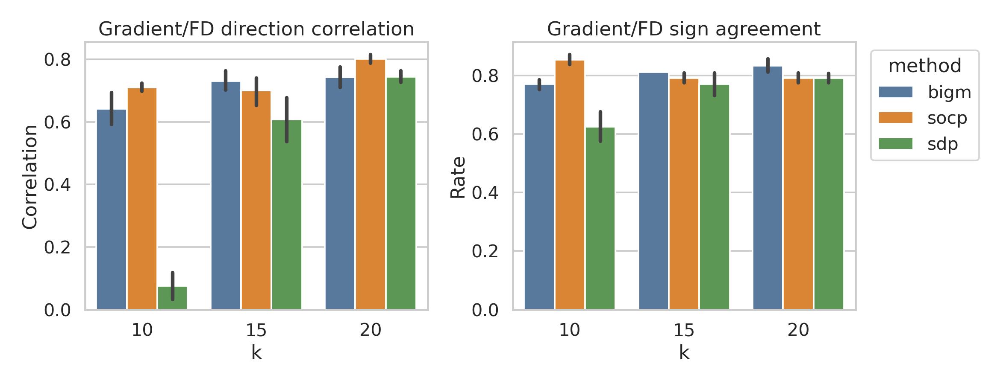
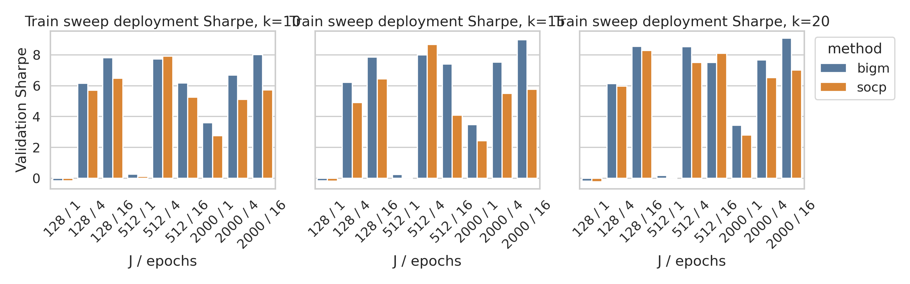
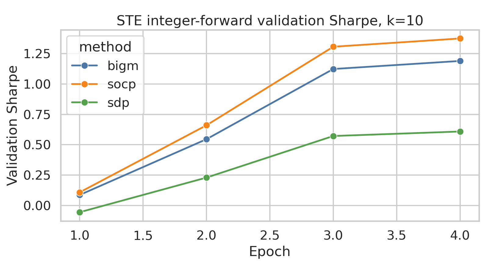

# SDP/SOCP/Big-M 补充诊断结果

日期：2026-05-14  
数据：`paper50`，2015-2020 口径，50 只资产，Fama-French 五因子。  
环境：WSL `.venv`，CVXPY 1.4.4，CVXPYLayers 0.1.6，SCS 3.2.2，
Gurobi 13.0.2。

## 已完成的实验

| 实验 | 范围 | 状态 |
|---|---|---|
| Relaxation quality | 24 windows, k=10/15/20, Big-M/SOCP/SDP | 完成 |
| SDP relaxation CLARABEL 复核 | 24 windows, k=10/15/20 | 完成 |
| Gradient alignment | 3 windows, k=10/15/20, 32 bootstrap, 16 directions | 完成 |
| Train sweep | Big-M/SOCP, 1 window, k=10/15/20, J={128,512,2000}, epochs={1,4,16} | 完成 |
| SDP train sweep | N=50, k=10 | full grid 不可合理完成；完成 J=16, epoch=1 micro |
| Integer-forward STE | 1 window, k=10, n=32, epochs=4, Big-M/SOCP/SDP | 完成 |

完整汇总 CSV 和图在 [`sdp_diagnostics_results/`](sdp_diagnostics_results/)。

## 主要结论

第一，SDP relaxation 的数学 tightness 在高精度求解器下确实很强，但代价很高。
用 CLARABEL 复核后，SDP 的 rounded gap 基本接近 0，top-k overlap 也高；
但单次 SDP relaxation 的中位求解时间约 23-27 秒，而 Big-M/SOCP 分别约
0.08/0.14 秒。

第二，SCS 直接解 SDP relaxation 的 bound 不可靠。SCS 版 SDP 在 full run 中出现
4.6%-7.7% 的平均 `bound_violation`；CLARABEL 复核把 violation 降到约 0.1%-0.15%。
所以 SDP bound 相关结论应优先看 CLARABEL 复核，不应直接解释 SCS 版 SDP gap。

第三，gradient alignment 不支持“SDP 更紧所以梯度更好”。平均相关性：
SOCP `0.737`，Big-M `0.705`，SDP `0.476`。其中 `k=10` 下 SDP 相关性只有
`0.076`，符号一致率 `0.625`。这说明 SDP tightness 没有稳定转化为更好的
integer-forward loss 梯度代理。

第四，training sweep 显示 Big-M/SOCP 可以完整跑完推荐网格，但 SDP N=50
differentiable training layer 很难在当前机器上做 full sweep。`J=16, epoch=1`
的 SDP micro run 已经用时约 6 分钟；尝试 `J=128, epoch=1` 超过 20 分钟未完成。

第五，STE integer-forward 小切片中，SOCP 最好，Big-M 次之，SDP 最弱。最终
validation Sharpe 分别约为：SOCP `1.375`，Big-M `1.190`，SDP `0.609`。

## 图表

## 关键数值

### Relaxation Quality

| k | method | gap_to_exact | bound_violation | rounded_gap | topk_overlap | solve_time |
|---:|---|---:|---:|---:|---:|---:|
| 10 | Big-M | 0.018462 | 0.000000 | 0.001794 | 0.950000 | 0.077s |
| 10 | SOCP | -0.000210 | 0.000451 | 0.000361 | 0.970833 | 0.141s |
| 10 | SDP/CLARABEL | -0.001126 | 0.001131 | 0.000165 | 0.983333 | 27.285s |
| 15 | Big-M | 0.002359 | 0.000000 | 0.000595 | 0.916667 | 0.077s |
| 15 | SOCP | -0.001024 | 0.001311 | 0.000149 | 0.925000 | 0.161s |
| 15 | SDP/CLARABEL | -0.001512 | 0.001512 | 0.000004 | 0.938889 | 24.876s |
| 20 | Big-M | 0.000144 | 0.000000 | 0.000060 | 0.847917 | 0.078s |
| 20 | SOCP | 0.000277 | 0.000844 | 0.000073 | 0.843750 | 0.143s |
| 20 | SDP/CLARABEL | -0.001341 | 0.001341 | 0.000001 | 0.854167 | 22.803s |

### Gradient Alignment

| k | method | corr | sign_agreement | grad_norm | bad_solves |
|---:|---|---:|---:|---:|---:|
| 10 | Big-M | 0.641960 | 0.770833 | 1.933383 | 0 |
| 10 | SOCP | 0.709951 | 0.854167 | 0.535206 | 0 |
| 10 | SDP | 0.075915 | 0.625000 | 0.197264 | 0 |
| 15 | Big-M | 0.730664 | 0.812500 | 2.082196 | 0 |
| 15 | SOCP | 0.700104 | 0.791667 | 0.759512 | 0 |
| 15 | SDP | 0.607245 | 0.770833 | 0.285691 | 0 |
| 20 | Big-M | 0.742224 | 0.833333 | 2.321070 | 0 |
| 20 | SOCP | 0.801107 | 0.791667 | 0.923217 | 0 |
| 20 | SDP | 0.744323 | 0.791667 | 0.237685 | 0 |

## 对导师问题的当前回答

这组诊断支持一个更细的结论：SDP 是强 relaxation，但在这个 E2E setting 中还没有
显示为更好的 training surrogate。SDP 的 rounded portfolio 可以非常接近 exact，
但它的 implicit gradient alignment 在小 k 下明显弱，而且 N=50 differentiable
training 成本很高。Big-M 虽然从 bound 角度更松，却提供了更便宜、更稳定、且
整体不差的梯度代理。

因此目前不能说“SDP 没用”。更准确的说法是：SDP 对优化 relaxation 很有价值；
但在这篇论文的 train-time relaxed layer、test-time exact MIQP 部署流程下，SDP
没有被证明是最有效的可微训练 surrogate。
