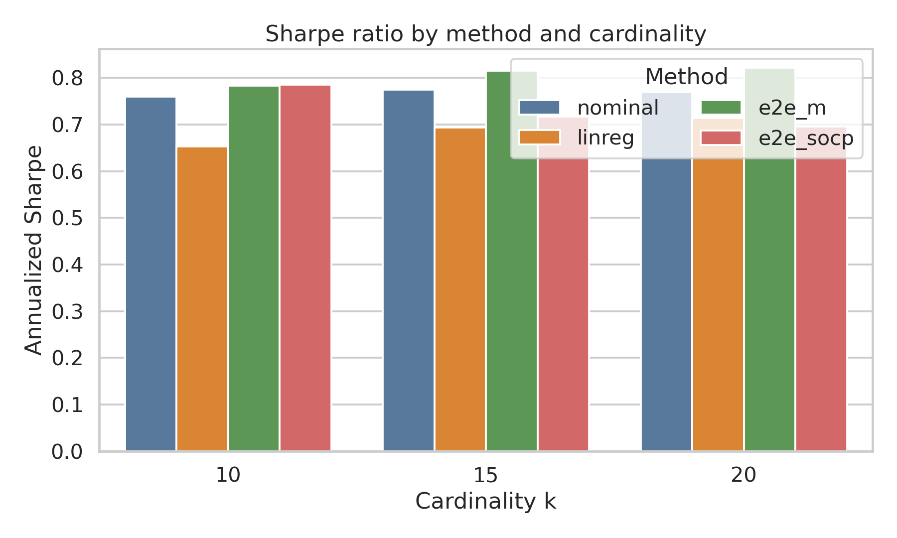
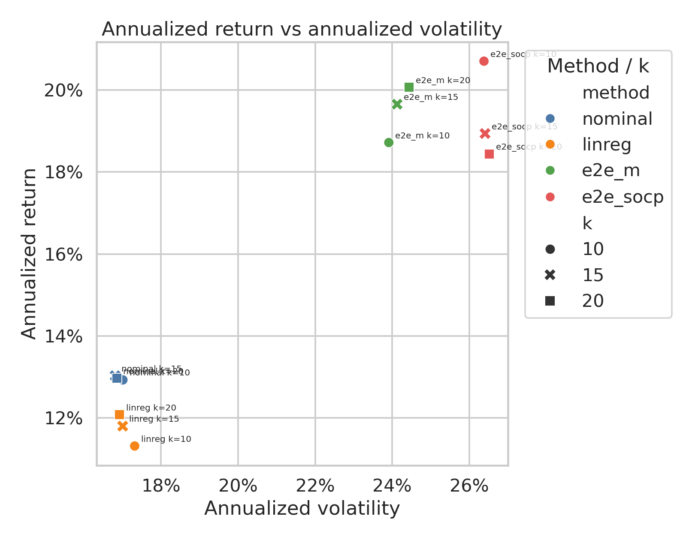
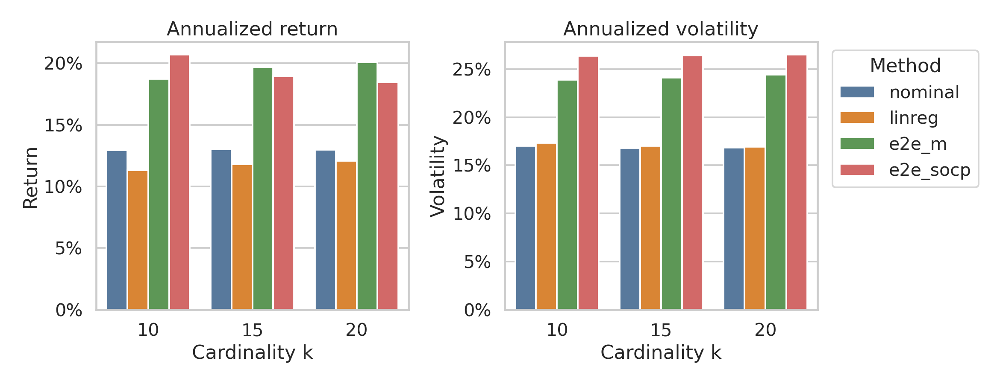
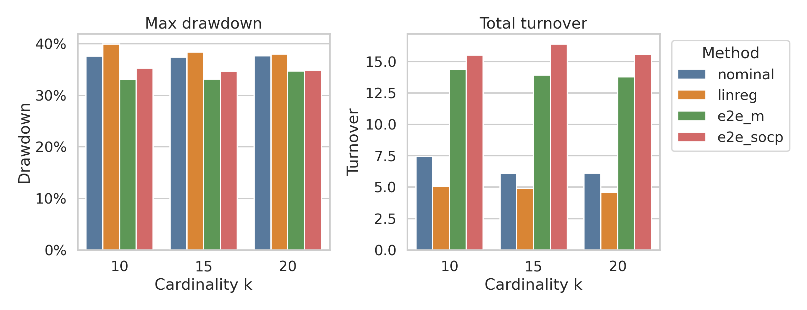
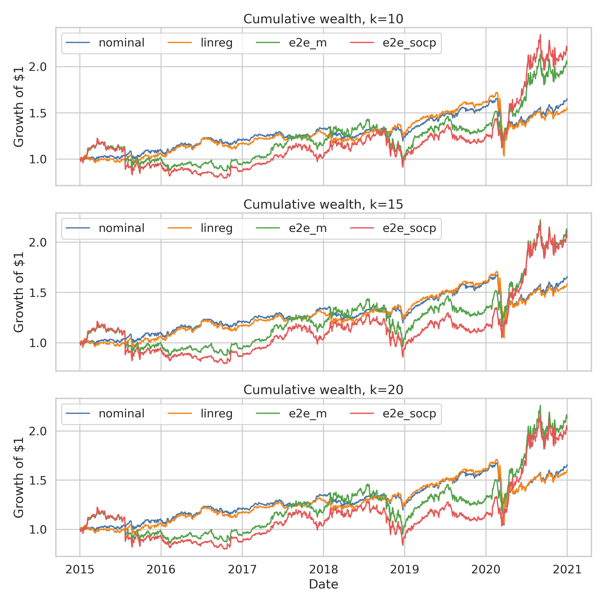

# 2015-2020 可视化结果报告

这份报告汇总当前已经完成的 2015-2020 主体实验。范围包括
`nominal`、`linreg`、`e2e_m`、`e2e_socp`，每个方法覆盖
`k = 10, 15, 20`。SDP 版本还没有放进这里，因为它仍然应该作为单独的长耗时
计算任务处理。

当前环境使用的是 SCS 3.2.2；论文报告的是 SCS 3.2.1。Gurobi license 已经可用，
测试阶段的 MIQP 求解正常完成。

## 主要结论

E2E 方法相对两个 decoupled baseline 明显提高了年化收益。当前已完成实验中，
`e2e_m, k=20` 的 Sharpe 最高，为 `0.821`；`e2e_socp, k=10` 的年化收益最高，
为 `20.7%`。代价是波动率和换手率都明显更高。

## 指标表

| method | k | annRet | annVol | Sharpe | maxDD | Calmar | Sortino | Turnover |
|---|---:|---:|---:|---:|---:|---:|---:|---:|
| nominal | 10 | 12.9% | 17.0% | 0.760 | 37.6% | 0.343 | 1.437 | 7.47 |
| nominal | 15 | 13.0% | 16.8% | 0.775 | 37.4% | 0.348 | 1.478 | 6.09 |
| nominal | 20 | 13.0% | 16.9% | 0.769 | 37.7% | 0.344 | 1.460 | 6.10 |
| linreg | 10 | 11.3% | 17.3% | 0.653 | 40.0% | 0.283 | 1.156 | 5.06 |
| linreg | 15 | 11.8% | 17.0% | 0.694 | 38.4% | 0.307 | 1.271 | 4.89 |
| linreg | 20 | 12.1% | 16.9% | 0.713 | 38.0% | 0.318 | 1.323 | 4.58 |
| e2e_m | 10 | 18.7% | 23.9% | 0.783 | 33.1% | 0.566 | 1.114 | 14.39 |
| e2e_m | 15 | 19.7% | 24.1% | 0.815 | 33.1% | 0.594 | 1.153 | 13.95 |
| e2e_m | 20 | 20.1% | 24.4% | 0.821 | 34.7% | 0.578 | 1.136 | 13.79 |
| e2e_socp | 10 | 20.7% | 26.4% | 0.785 | 35.3% | 0.587 | 1.012 | 15.54 |
| e2e_socp | 15 | 18.9% | 26.4% | 0.717 | 34.7% | 0.546 | 0.911 | 16.42 |
| e2e_socp | 20 | 18.4% | 26.5% | 0.695 | 34.9% | 0.529 | 0.869 | 15.57 |

完整机器可读指标在
[`metrics_summary_2015_2020.csv`](metrics_summary_2015_2020.csv).

## 图表

## 解读

`e2e_m` 是当前完成实验里风险调整收益最稳定的方法：三个 cardinality 下的
Sharpe 都高于两个 baseline，其中 `k=20` 是全局最高。`e2e_socp` 的结果更混合：
它在 `k=10` 下拿到最高年化收益，但更高的波动率使得三个 cardinality 的 Sharpe
都低于 `e2e_m`。

两个 baseline 更保守。它们的 realized volatility 和 turnover 明显更低，但年化收益
也更低。在这次数据和配置下，`nominal` 在多数关键指标上优于 `linreg`。

累计财富曲线也体现了同一个权衡：E2E 路径在样本期末更高，但中间波动更大。
换手率图需要重点看，因为当前这些 headline metrics 还没有扣除交易成本。
